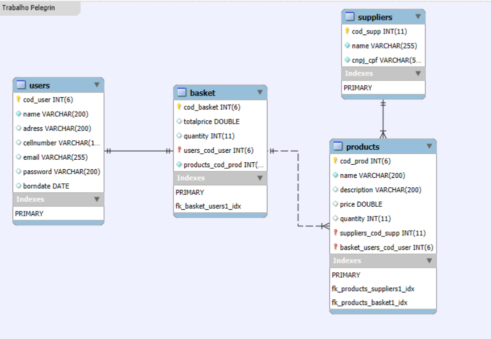

# Mini Sistema de Gestão de Produtos

Este projeto é um Mini Sistema de Gestão de Produtos desenvolvido para a disciplina Programação para Internet, utilizando, Armazenamento, Autenticação e entre outras técnicas. O sistema permite o cadastro de usuários, produtos, fornecedores e a criação de uma cesta de compras.

## Funcionalidades

1. Cadastro de Usuários
Os usuários podem se registrar no sistema, com senha protegida por hash SHA256.
Apenas usuários autenticados podem acessar o sistema.

2. Gestão de Produtos e Fornecedores
Área para cadastro, edição e exclusão de produtos.
Os dados são armazenados em um banco de dados MySQL.

3. Criação de Cesta de Compras
Exibição de produtos com a possibilidade de seleção por checkbox.
Após a seleção, os produtos são adicionados à cesta de compras.
A cesta exibe um resumo com o valor total e a quantidade de produtos.

4. Atualização Dinâmica com AJAX
Atualização dos dados de produtos, fornecedores e cesta sem recarregar a página usando AJAX.

5. Exibição da Cesta
Página dedicada para exibir a cesta de compras, com resumo do valor total e quantidade de produtos.

## Tecnologias Utilizadas

PHP: Backend do sistema, responsável pela lógica de negócio e conexão com o banco de dados.,

MySQL: Banco de dados utilizado para armazenar informações de usuários, produtos, fornecedores e cestas.

HTML/CSS: Para a interface visual.

Bootstrap: Frameworks para estilização da interface.

JavaScript (AJAX): Para interações dinâmicas no frontend sem recarregar a página.

# Modelagem
## Diagrama Entidade Relacionamento (DER)

## Relacionamentos
Usuário possui uma Cestas.
Cesta contém múltiplos Produtos.
Fornecedor pode ter múltiplos Produtos.

## Esboços de Telas

Os esboços das telas foram criados usando o Figma e estão disponíveis abaixo:

[Figma](https://www.figma.com/design/7ZEeWRXvMNl7MWIOLnfNed/Trabalho-pelgrin?node-id=0-1&node-type=canvas&t=6h9z0X4QWHVVhItG-0)

Allan Gabriel Moreira da Silva - RA: 252256-1

Arthur Bertolino Ledur - RA:

Ingrid Bearari de Oliveira - RA:

Vitor dos Santos Trentini - RA:
